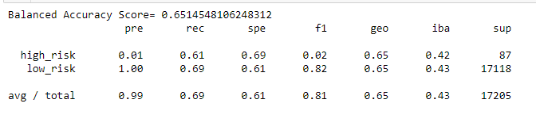
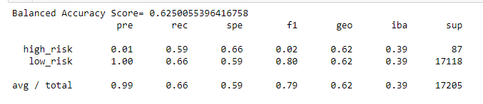
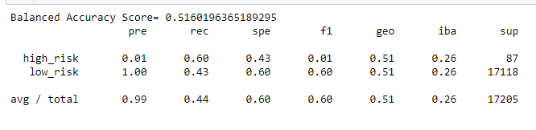
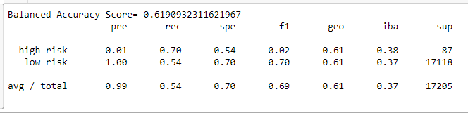
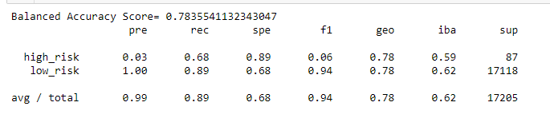
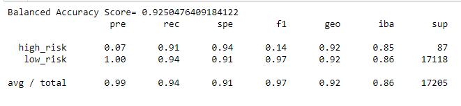

# Supervised Machine Learning and Credit Risk

* Naive Random Oversampling
  * Balanced Accuracy Score  
  * Precision Score
  * Recall Score  
  *   
  
* SMOTE Oversampling
  * Balanced Accuracy Score  
  * Precision Score
  * Recall Score
  *   

* Cluster Centroids Resampler
  * Balanced Accuracy Score  
  * Precision Score
  * Recall Score
  * 

* SMOTEEN
  * Balanced Accuracy Score  
  * Precision Score
  * Recall Score
  *   

* Balanced Random Forest Classifier
  * Balanced Accuracy Score  
  * Precision Score
  * Recall Score
  *   

* Easy Ensemble AdaBoost Classifier
  * Balanced Accuracy Score  
  * Precision Score
  * Recall Score
  *   
